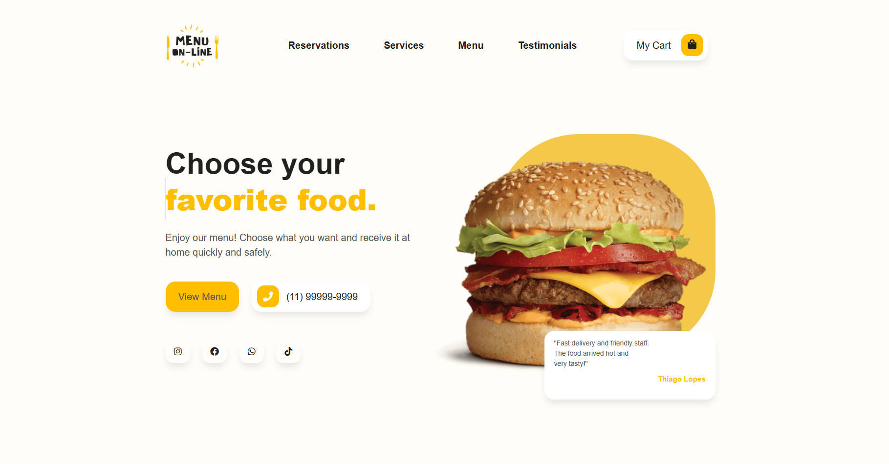

## 🍽️ Restaurant Webpage Project  
A responsive and modern restaurant landing page built with HTML, CSS, JavaScript, and Bootstrap, developed as part of my portfolio to continuously strengthen my front-end development skills.

This project showcases:

- Skill consolidation through real-world layout and UI logic

- Mobile-first responsiveness for seamless cross-device experience

- Accessible design with clean structure and intuitive navigation

- Modular, well-commented code for clarity and maintainability

- Professional presentation aimed at global recruiter visibility  

Created with a focus on clarity, scalability, and continuous improvement, each section reflects my commitment to writing readable, impactful code for international audiences.

---

## 📸 Preview

---

## 🚀 Features

- Clean and intuitive layout
- Responsive design for desktop and mobile
- English-commented code for global readability
- FontAwesome icons and Bootstrap styling
- Modular file structure for easy maintenance

---

## 🛠️ Technologies Used

- HTML5
- CSS3
- JavaScript
- Bootstrap 4
- FontAwesome

---

## 📂 Project Structure

plaintext
├── index.html
├── css/
│   └── main.css
├── js/
│   └── scripts.js
├── fonts/
├── img/
└── README.md

## 🚀 How to Use

Clone the repository:

bash: git clone https://github.com/GuihJF/PaginaRestaurante.git  

## 📚 Project Origin

This restaurant landing page was originally built during a front-end development course using HTML, CSS, JavaScript, and Bootstrap. 
While the original course materials are no longer available, the structure and design were adapted and expanded based on what I learned. 
All code has been reviewed, reorganized, and documented in English for global accessibility and recruiter-friendly presentation.

## 🧠 Author
### Guilherme Francisco  
🌍 Bogotá, Colombia   
Role: Help Desk IT Specialist & Junior Data Analyst  
📧 https://www.linkedin.com/in/guilherme-francisco-9320591b5/ 
